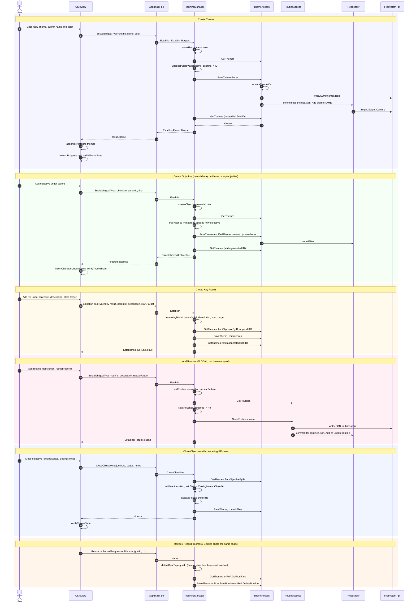

# uc-1 — Manage OKR Hierarchy

**Purpose:** Create and edit themes, objectives, key results, and routines via a single behavioral API (`Establish` / `Revise` / `RecordProgress` / `Dismiss`).

## Notes — error / atomicity / git

- Each `SaveTheme` is committed in its own git transaction by `commitFiles(repo, …)` (Begin → Stage → Commit) inside `ThemeAccess`; routine writes commit `routines.json` via `RoutineAccess`.
- Frontend uses optimistic update + `verifyThemeState()` (uc-8); on backend error the view calls `loadThemes()` to re-sync.

## Drift vs `bearing.method`

Aligned. The model now lists the behavioral quartet (`Establish` / `Revise` / `RecordProgress` / `Dismiss`) plus `GetHierarchy`, `SuggestAbbreviation`, and the status/close/reopen lifecycle ops. `RoutineAccess` is now a first-class `resource_access` component and global routine sequences route through it (no longer through `ThemeAccess`).
