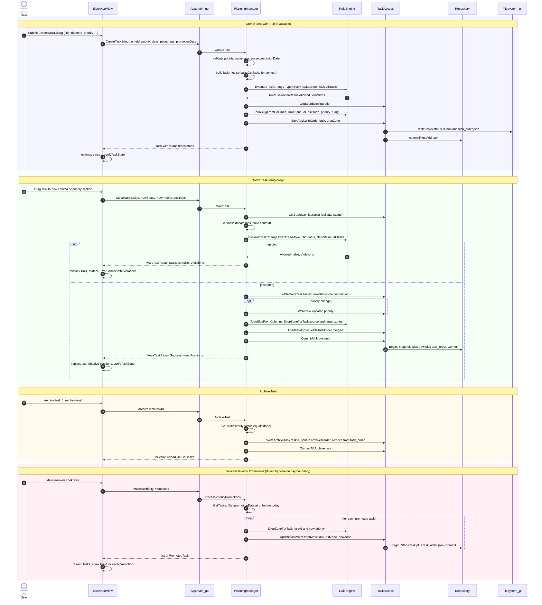

# uc-2 — Manage Tasks

**Purpose:** Create, move, archive, restore, and priority-promote tasks on the EisenKan board.

## Notes — error / atomicity / git

- Move/Archive use `WriteX` + `CommitAll` so the task file move, priority rewrite, and `task_order.json` update land in **one** git commit (atomic).
- Rule violations short-circuit BEFORE any write; the frontend rolls the DnD back and shows an `ErrorDialog`.

## Drift vs `bearing.method`

Aligned. Sequences match. The "verifies task is done" step inside `ArchiveTask` is implemented as a `GetTasks` walk rather than a dedicated guard — captured at intent level in the model.
