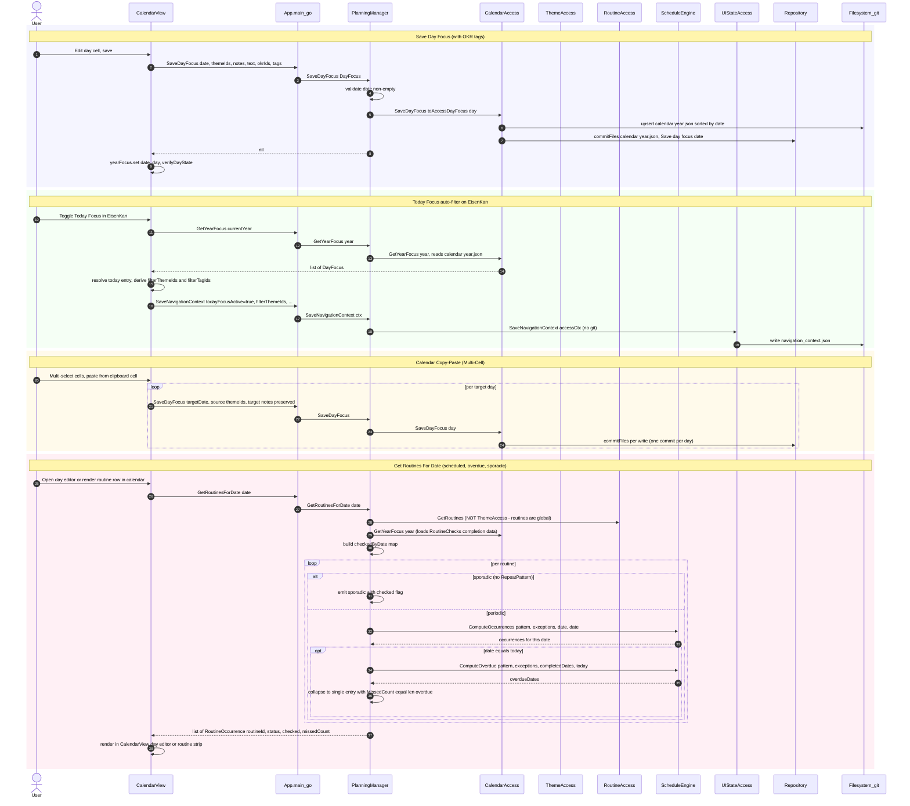

# uc-3 — Focus Daily Work

**Purpose:** Assign themes / OKR IDs / tags to calendar days, drive auto-filtering of EisenKan, and resolve routines for a date.

## Notes — error / atomicity / git

- Day focus writes are git-committed per save; copy-paste is a loop of independent commits (not transactional across days).
- `SaveNavigationContext` is intentionally *not* git-committed (UI state only).

## Drift vs `bearing.method`

Aligned. The model now routes `GetRoutinesForDate` through `RoutineAccess` (routines are global), documents the overdue collapse to a single entry per routine with `MissedCount` (only emitted when `date == today`), and includes the `RescheduleRoutineOccurrence` sequence with `Routine.Exceptions []ScheduleException`.
