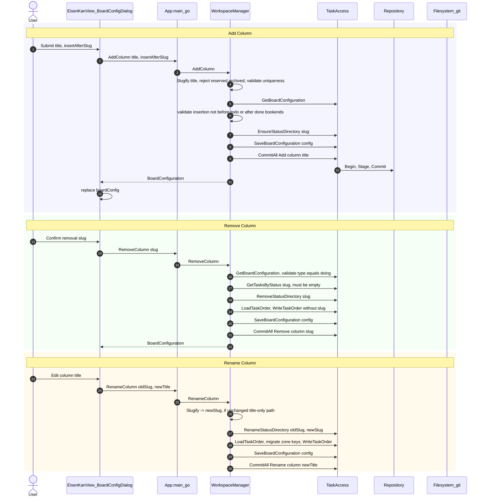

# uc-4 — Configure Board

**Purpose:** Add / remove / rename / reorder kanban columns, with bookend constraints (todo first, done last).

## Notes — error / atomicity / git

- All column ops use `taskAccess.CommitAll(...)` so directory rename + config update + `task_order.json` migration land in one git commit.
- Frontend has no optimistic updates here — it waits for the new `BoardConfiguration` from the backend before re-rendering columns.

## Drift vs `bearing.method`

Aligned. Model captures column ops at intent level; the code's `LoadTaskOrder`/`WriteTaskOrder` write-only mutex pair is summarised as `SaveTaskOrder` in the model — equivalent semantics.
