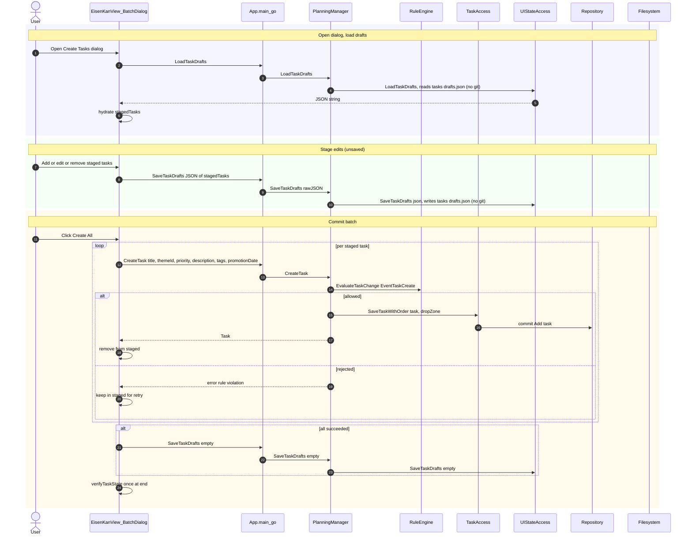

# uc-5 — Batch Create Tasks

**Purpose:** Stage multiple tasks in a draft dialog, persist drafts without git, then commit them as a batch.

## Notes — error / atomicity / git

- Each task is its own git commit; the batch is **not** atomic. Failed tasks remain in the draft for retry.
- Drafts are NOT git-versioned (`UIStateAccess`).

## Drift vs `bearing.method`

Aligned.
