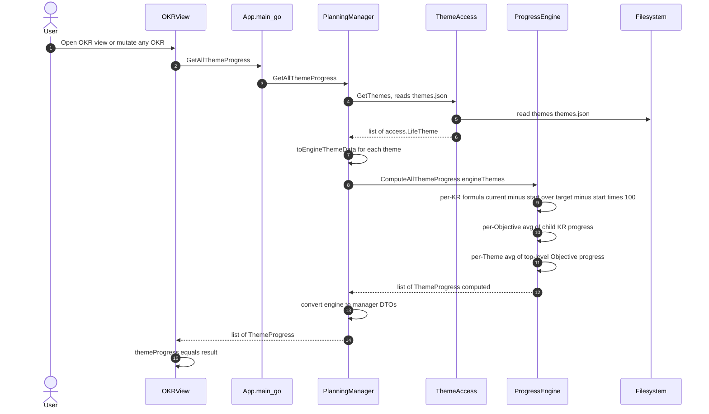

# uc-6 — Compute Progress

**Purpose:** Compute progress for the OKR hierarchy. Read-only, no persistence.

## Notes — error / atomicity / git

- Pure computation; no commits, no side effects.

## Drift vs `bearing.method`

Aligned. `ProgressEngine` is a first-class engine in the model; `PlanningManager` description and uc-6 text now state that the manager fetches themes via `ThemeAccess` and delegates the entire computation to `ProgressEngine`. The stale "should be extracted" assessment has been removed.
