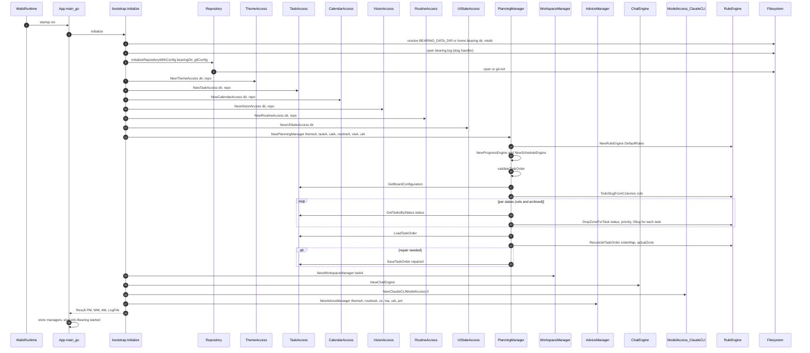

# uc-7 — Initialize System

**Purpose:** Resolve data dir, set up logging, open / init git repo, wire access components and managers, and validate / repair task order.

## Notes — error / atomicity / git

- Failure of any step is fatal (`bootstrap.Initialize` returns error, app logs and exits the startup path).
- Task order repair is a single `SaveTaskOrder` call (atomic write, but normally a fast-path no-op).

## Drift vs `bearing.method`

Aligned. The model now has `App.startup` delegate to `bootstrap.Initialize()` as the composition root, with `bootstrap` constructing every access component (including `RoutineAccess` and `ModelAccess`), every engine (`RuleEngine`, `ProgressEngine`, `ScheduleEngine`, `ChatEngine`), and all three managers (`PlanningManager`, `WorkspaceManager`, `AdviceManager`). The validator's `client-orchestration` and `closed-layer-skip` findings on this use case are linked to a recorded architectural decision (`Accept App-as-bootstrapper`, status `active`).
