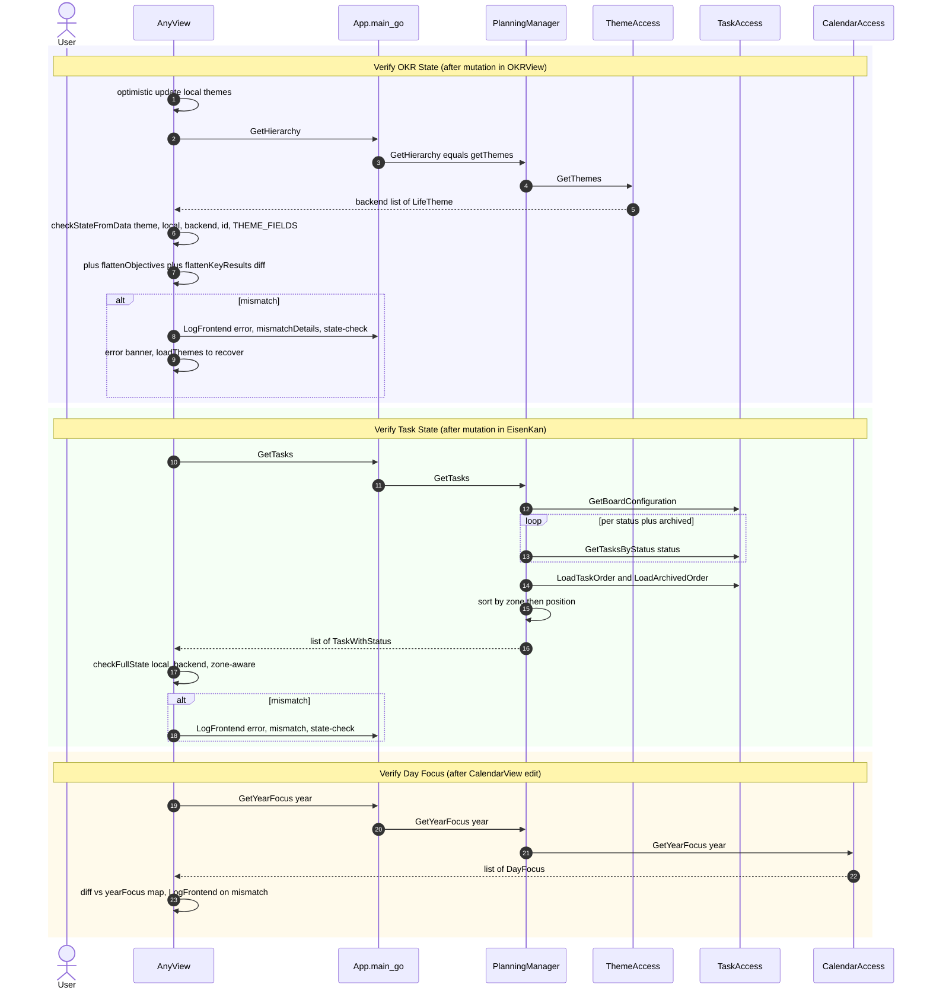

# uc-8 — Verify Frontend-Backend State

**Purpose:** After every mutation, re-fetch backend state and diff it against the optimistic client state; log mismatches.

## Notes — error / atomicity / git

- This is a *read-only* verification pattern; no commits.
- The `LogFrontend` binding writes to slog (not git). It's the user-facing failsafe when optimistic UI diverges from the source of truth.

## Drift vs `bearing.method`

Aligned. Implementation in `frontend/src/lib/utils/state-check.ts` (`checkStateFromData`, `checkFullState`).
