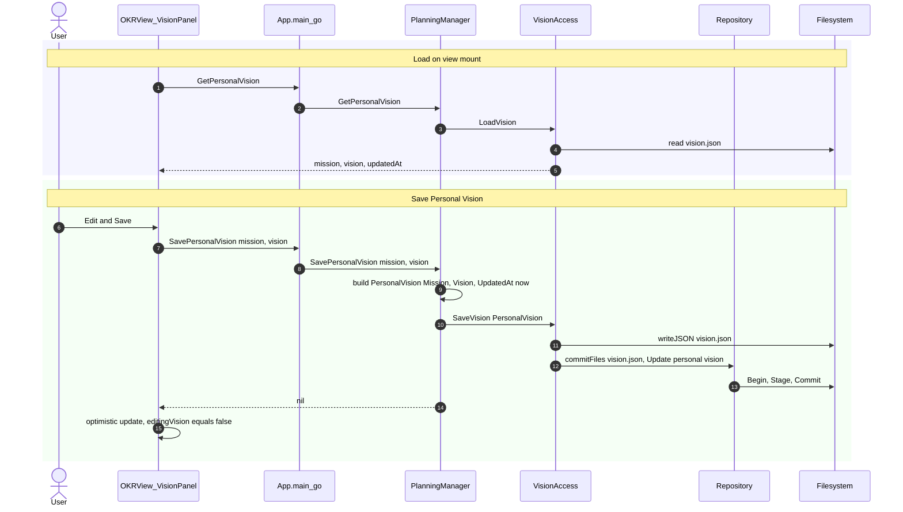

# uc-9 — Manage Personal Vision

**Purpose:** Read / update the personal mission and vision statements (root motivational context).

## Notes — error / atomicity / git

- Single-file commit per save; no rule evaluation.

## Drift vs `bearing.method`

Aligned.
