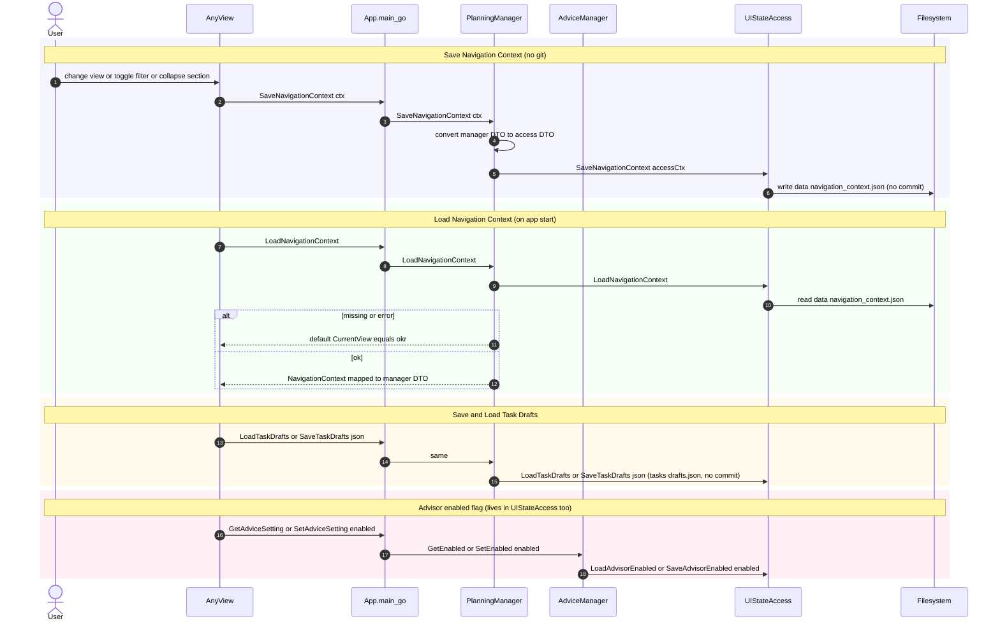

# uc-10 — Persist UI State

**Purpose:** Persist transient UI state (navigation context, task drafts, advisor enabled flag) without git versioning.

## Notes — error / atomicity / git

- Intentionally NOT git-versioned. Errors during load fall back to a default context; errors during save are surfaced but non-fatal.

## Drift vs `bearing.method`

Aligned. `UIStateAccess` description now enumerates three concerns: navigation context, task drafts, and advisor enabled flag (`Save/LoadAdvisorEnabled` against `advisor.json`).
