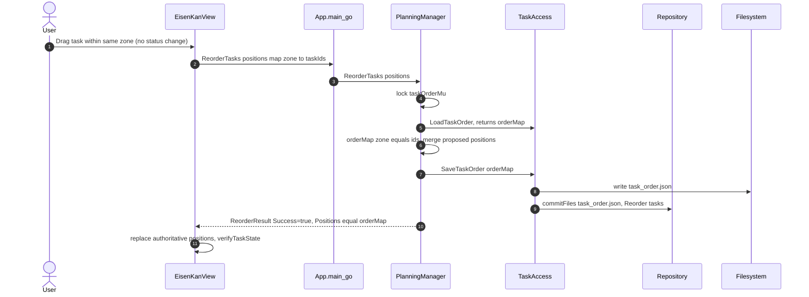

# uc-11 — Reorder Tasks

**Purpose:** Persist intra-zone drag-and-drop order changes within columns.

## Notes — error / atomicity / git

- Single-file commit; serialised by `taskOrderMu`.
- The Manager merges proposed positions into the **full** order map so untouched zones aren't clobbered.

## Drift vs `bearing.method`

Aligned.
