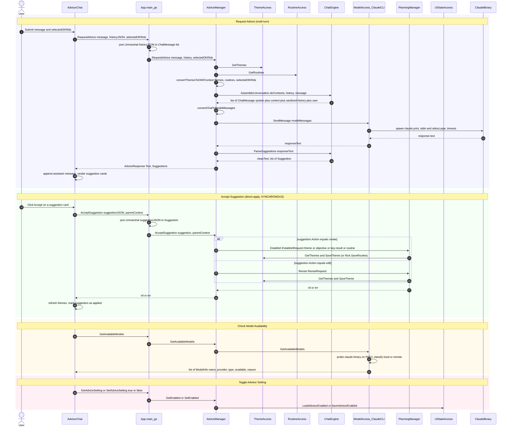

# uc-12 — Request Goal Advice

**Purpose:** AI-powered chat advisor over the OKR hierarchy; can apply structured suggestions back to PlanningManager.

## Notes — error / atomicity / git

- LLM call has its own timeout (per `ClaudeCLIModelAccess`); errors from `claude` are mapped to user-friendly strings before bubbling up.
- Suggestions that mutate OKRs go through PlanningManager and inherit its git-commit semantics (one commit per accepted suggestion).

## Drift vs `bearing.method`

Aligned. The model now marks `AdviceManager → PlanningManager AcceptSuggestion` as `sync: true` and notes "synchronous direct method call from `AdviceManager.acceptCreate`/`acceptEdit` to `PlanningManager.Establish`/`Revise`. No queue, no message bus, no goroutine indirection." The validator's `same-layer-call` finding is linked to a recorded architectural decision (`Accept synchronous AdviceManager → PlanningManager call as documented architectural debt`, status `revisit`).
